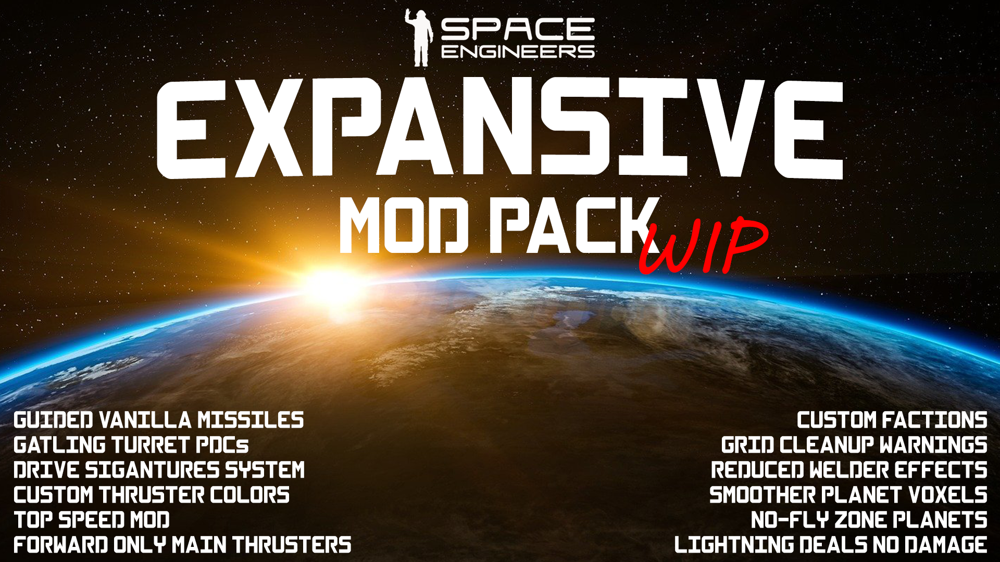

<a name="readme-top"></a>

<!-- PROJECT HEADER -->
<br />
<div align="center">
  <a href="https://github.com/lottehime/Expansive-Mods-SE">
    
  </a>

  <h2 align="center">Expansive Mods for Space Engineers</h2>

  <p align="center">
    A <b><i>backwards compatible</i></b> Space Engineers mod pack to add QoL improvements and features in the style of <strong>THE EXPANSE</strong>!
    <br><br />
    <a href="https://github.com/lottehime/Expansive-Mods-SE/issues">Report A Bug 💥</a>
    ·
    <a href="https://github.com/lottehime/Expansive-Mods-SE/issues">Request A Feature 🚀</a>
  </p>
</div>

<div align="center">

[![Contributors][contributors-shield]][contributors-url] [![Stargazers][stars-shield]][stars-url] [![Issues][issues-shield]][issues-url] 

[contributors-shield]: https://img.shields.io/github/contributors/lottehime/Expansive-Mods-SE.svg?style=for-the-badge
[contributors-url]: https://github.com/lottehime/Expansive-Mods-SE/graphs/contributors
[stars-shield]: https://img.shields.io/github/stars/lottehime/Expansive-Mods-SE.svg?style=for-the-badge
[stars-url]: https://github.com/lottehime/Expansive-Mods-SE/stargazers
[issues-shield]: https://img.shields.io/github/issues/lottehime/Expansive-Mods-SE.svg?style=for-the-badge
[issues-url]: https://github.com/lottehime/Expansive-Mods-SE/issues
<!--
[license-shield]: https://img.shields.io/github/license/lottehime/Expansive-Mods-SE.svg?style=for-the-badge
[license-url]: https://github.com/lottehime/Expansive-Mods-SE/blob/master/LICENSE.txt
-->

</div>

<!-- TABLE OF CONTENTS -->
<details>
  <summary>Table of Contents</summary>
  <ol>
    <li><a href="#about-expansive-mods">About Expansive Mods</a></li>
    <li><a href="#features">Features</a></li>
    <li><a href="#roadmap">Roadmap</a></li>
    <li><a href="#installation">Installation</a></li>
    <li><a href="#built-with">Built With</a></li>
    <li><a href="#contributing">Contributing</a></li>
    <li><a href="#license">License</a></li>
    <li><a href="#contact">Contact</a></li>
    <li><a href="#acknowledgments">Acknowledgments</a></li>
  </ol>
</details>


<!-- ABOUT -->
## About Expansive Mods

⚠️WIP!⚠️

Expansive Mods aims to add gameplay elements to Space Engineers in the style of THE EXPANSE, while allowing ship blueprints and saves to be backwards compatible if you decide to revert to base gameplay.

It also adds some small quality of life changes to solve gameplay elements that I find frustrating (jagged planet voxels you can't traverse, welder flickering eye fatigue, etc.)

There are lots of THE EXPANSE style mods, why another?
* Most of them have additional custom blocks that break backwards compatibility.
* Some have balance problems and other quirks.
* If they disappear or break, my personal server and saves as well as blueprints would be toast 🍞!
* Give some default blocks that have little to no practical function more purpose (like the heat vent).
* It looked like fun to put together 😄.

<p align="right">(<a href="#readme-top">back to top</a>)</p>


<!-- FEATURES -->
## Features

### Thrust & Systems
<details>
  <summary>Mods & Features</summary>

#### 1. Custom Thruster Flame Colors:
```
ExpansiveThrustColor
```
* Blue for large thrusters for both grid sizes (to represent fusion drives).
* Transparent white for small thrusters for both grid sizes (to represent RCS thrusters).

#### 2. Higher Top Speed:
```
ExpansiveThrustTopSpeed
```
* Small grid max speed changed to 350m/s for more reasonable travel speeds without breaking game physics.
* Large grid max speed changed to 300m/s for more reasonable travel speeds without breaking game physics.

#### 3. Drive Signatures System:
```
ExpansiveThrustDriveSigs
```
* Beacon blocks are required on ships. They are used to transmit drive signatures.
* Thrusters produce a thermal load that combines to produce a signature strength (beacon text for size of signature and distance of beacon broadcast.
* Heat Vent blocks help to reduce a thermal signature.
* Non-ship grids, or atmospheric grids have custom non-ship signatures.
* Beacons have an anti-tamper feature to stop players from tampering with signatures.
* Antennae can be used as transponders to broadcast a ship name with the signature, or run without an ID.
* Antennae are free to be used to display comms text as ship name broadcast can be done via the beacon per above.
* Large thrusters placed / built in a direction other than forward are disabled.
* Large thrusters (main drives) are turned off at init for safety.

</details>

### Weapons
<details>
  <summary>Mods & Features</summary>

#### 5. Gatling Turret PDCs:
```
ExpansiveWeaponsPDC
```
* The fire rate of gatling turrets, gatling guns and interior turrets has been increased to enable them to more reliably strike incoming missiles, allowing them to function as PDCs.
* The damage has been reduced on them, so that the same DPS is achieved, keeping the balance more or less the same for backwards compatibility.
* Tracers have been added to Small Cal, Pistol Cal, Large Cal and Autocannon Shell ammo based guns for a better gameplay experience, and for visuals.

#### 6. Guided Missiles (Torpedos):
```
ExpansiveWeaponsGuidedMissiles
```
* Vanilla missiles can act as aimed or guided missiles.
* Locking a target will convert missiles to guided missiles so that they can act as guided torpedos.
* The missiles when locked, will arc almost instantly from the launcher, towards their target. Consider this when building! You don't want to not have enough clearance, or fire from a wrong facing launcher and torpedo yourself!
* When a target is not locked, they will return to the default aimed missile system.
* Missile max speed is increased to 340m/s to avoid collision when launching at full speed. Also means small grids at max speed can outrun them, but large grid cannot and must mitigate them.
* Missile max distance before explosion increased to 2.5km.

</details>

### Utilities
<details>
  <summary>Mods & Features</summary>

#### 7. Cleanup Warning:
```
ExpansiveUtilCleanupWarning
```
* Custom cleanup warning is announced when a player enters a cockpit attached to a grid, these requirements are hard coded to match the server settings I run for this gameplay experience.
* Grids must:
  * Be larger than 20 blocks.
  * Have a beacon.
  * Not have default names.
  * Be owned by a player or NPC faction.

#### 8. Additional NPC Factions:
```
ExpansiveUtilFactions
```
* NPC factions based on THE EXPANSE are added to the save:
  * MCRN
  * UNN
  * OPA
  * Protogen
  * Tycho Manufacturing
  * Free Navy
  * Transport Union
  * Laconian Imperial Navy
  * The Underground
* Added for later NPC integration.

</details>

### Environmental Changes
<details>
  <summary>Mods & Features</summary>

#### 9. Welder Fix:
```
ExpansiveEnvWeldFix
```
* Welder flickering and effect intensity is reduced to hopefully help eye fatigue and those who may be sensitive to it.

#### 10. Disable Lightning Damage:
```
ExpansiveDisableLightningDamage
```
* Base game lightning looks neat, but it works poorly. Lightning damage is disabled because of this.

#### 11. Smooth Planet Details:
```
ExpansiveEnvSmoothPlanetDetails
```
* Surface details are removed from planets, smoothing their voxels.
* Does mute some fine detail, but arguably produces a more realistic terrain shape and makes grids behave much more reliably when moving over terrain in vehicles.

#### 12. Planetary Damage (No Fly Zones):
```
ExpansiveEnvPlanetaryDamage
```
* WIP. Intended to integrate with Sol System mod component. May be split into two parts.
* Allows for planets to be added to the code so that they have the script enabled.
* Planets with the script enabled will display a warning as a grid approaches them.
* Once a grid moves beyond the threshold, it will begin to rapidly take damage and be destroyed.
* Can be used/modified to represent no fly zones, or planets with atmospheres or other conditions that would be incredibly harmful or destructive.

</details>

<p align="right">(<a href="#readme-top">back to top</a>)</p>


<!-- ROADMAP -->
## Roadmap

- [X] Add merge script for single mod publishing
- [X] Publish initial version to Steam Workshop
- [ ] Add themed ship blueprints
- [ ] Add mod for better hostile ship takeover vs. base game
- [ ] Add Sol system planets 
- [ ] Add Sol system sandbox save files
- [ ] Update Planetary Damage mod for Sol system
- [ ] Add default Torch server config and additional mod/plugin list
- [ ] Add themed MES mod for each factions ships
    - [ ] Faction ship blueprints
    - [ ] Faction comms dialogue (text)
    - [ ] Faction comms dialogue (audio)


See the [open issues](https://github.com/lottehime/Expansive-Mods-SE/issues) for additional community proposed features (and known issues).

<p align="right">(<a href="#readme-top">back to top</a>)</p>


## Installation

_For local play, subscribe to the mod on the [Steam Workshop page.](https://steamcommunity.com/sharedfiles/filedetails/?id=3002953565)._

_For server play, add the ID (3002953565) to your server config._

_To install manually instead of from the Steam Workshop:_

1. Download a zip of the repo and unpack it; <strong>or</strong>
2. Clone the repo
   ```sh
   git clone https://github.com/lottehime/Expansive-Mods-SE.git
   ```
3. Copy the 'ExpansiveMods' folder from within the 'Combined' folder from the repo into your Space Engineers Mods folder location:
   ```
   %AppData%\SpaceEngineers\Mods
   ```
4. Launch the game and create your save, selecting the individual mods from the pack that you want to use.

#### Alternative install:
_To install individual components only, locally:_
_Copy the individual mod parts from the 'Mods' folder from the repo into your Space Engineers Mods folder per above._

<p align="right">(<a href="#readme-top">back to top</a>)</p>


<!-- BUILT WITH -->
## Built With

<a href="#">
</a>

<a href="#">
</a>

<a href="#">
</a>

<p align="right">(<a href="#readme-top">back to top</a>)</p>


<!-- BUY ME A COFFEE -->
## Help Support More Like This

<a href="https://www.buymeacoffee.com/lottehime" target="_blank"></a>

<p align="right">(<a href="#readme-top">back to top</a>)</p>

<!-- CONTRIBUTING -->
## Contributing

If you have a suggestion that would make this better, please fork the repo and create a pull request. You can also simply open an issue with the tag "enhancement".
Don't forget to give the project a star! Thanks again!

1. Fork the Project
2. Create your Feature Branch (`git checkout -b feature/AmazingFeature`)
3. Commit your Changes (`git commit -m 'Add some AmazingFeature'`)
4. Push to the Branch (`git push origin feature/AmazingFeature`)
5. Open a Pull Request

<p align="right">(<a href="#readme-top">back to top</a>)</p>


<!-- LICENSE -->
## License

Distributed under the Creative Commons Attribution-NonCommercial-ShareAlike License. See `LICENSE.txt` for more information.

<p align="right">(<a href="#readme-top">back to top</a>)</p>


<!-- CONTACT -->
## Contact

<a href="#"></a> [@lotte_hime](https://twitter.com/lotte_hime)

<a href="#"></a> [https://github.com/lottehime/Expansive-Mods-SE](https://github.com/lottehime/Expansive-Mods-SE)

<p align="right">(<a href="#readme-top">back to top</a>)</p>


<!-- ACKNOWLEDGMENTS -->
## Acknowledgments

I am certainly just one of many who have thought to do, add or fix a lot of these ideas in one way or another.
So, a thanks goes out to the many other modders who inspired some of the ideas for these mods and who I referenced code or sbc changes from to get the ball rolling or find solves to roadblocks 🙂.

* Special thanks to [malware-dev](https://github.com/malware-dev) for MDK-SE and it's great documentation. It makes modding SE much easier.
* Special thanks to [Rexxar](https://github.com/rexxar-tc) for the (now defunct) mod on which Planetary Damage was based.
* Special thanks to [xirathonxbox](https://steamcommunity.com/id/xirathonxbox/myworkshopfiles/?appid=244850) for the drive signatures mod inspiration.

<p align="right">(<a href="#readme-top">back to top</a>)</p>

Space Engineers and THE EXPANSE trademarks, logos, names, etc. are the property of their respective owners. All company, product and service names used are for identification purposes only.

This is a fan project undertaken with fair use in mind and in good faith towards the rights holders.
Neither the project, nor I have any relation or affiliation to the above owners and/or rights holders.

<p align="right">(<a href="#readme-top">back to top</a>)</p>
